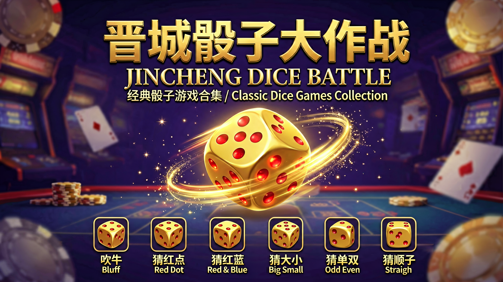

# 🎲 晋城骰子大作战 (Jincheng Dice Battle)

> **🏮 源自中国山西晋城的地方骰子玩法** — These six dice games are traditional folk games from Jincheng, Shanxi, China (中国山西省晋城市).
> 晋城骰子大作战收录了晋城地区流行的六种经典骰子玩法，是当地茶余饭后、亲友聚会的传统娱乐。



A collection of classic dice games that runs as a DSH Web GUI plugin. The sidebar entry "🎲 骰子大作战" opens the game panel right in the center column.

经典骰子游戏合集，作为 DSH Web GUI 插件运行。侧边栏「🎲 骰子大作战」入口打开游戏面板，直接在中心列游玩。

> **📌 当前状态：单机版** — Online multiplayer is temporarily disabled (`MP_DISABLED = true`); the game runs fully single-player vs AI. Networking will be restored in a later release.
> **当前为单机版**：联机功能暂缓上线（`MP_DISABLED`），目前为单人 vs AI 模式；后续版本恢复联机。

## Games / 玩法

> **📜 晋城传统玩法** — All six games are played across Jincheng, Shanxi, China.

- **Liar's Dice (吹牛)** — the classic bluffing dice game, single-player vs AI · 经典吹牛骰子，单人 vs AI
- **Guess Red Dots (猜红点)** · 晋城特色：①=1分 ④=4分
- **Guess Red/Blue (猜红蓝)** · 红蓝点对决
- **Guess Big/Small (猜大小)** · 大小博弈
- **Guess Odd/Even (猜单双)** · 单双对决
- **Guess Straight (猜顺子)** · 顺子挑战

The game is pure frontend HTML (`assets/index.html` + `peerjs.min.js` + `qrcode.min.js`), served same-origin by the plugin host via the `/dice-game/` route, loaded in the center-column iframe.

游戏为纯前端 HTML（`assets/index.html` + `peerjs.min.js` + `qrcode.min.js`），由插件 host 通过 `/dice-game/` 路由同源托管，在中心列 iframe 中加载。

## About / 关于玩法

**晋城骰子文化** (Jincheng Dice Culture)：

晋城骰子大作战收录的六种玩法均源自中国山西省晋城地区——这里是太行山南端的古城，民间骰子游戏历史悠久。吹牛、猜红点、猜红蓝、猜大小、猜单双、猜顺子，是晋城百姓聚会、待客时喜闻乐见的传统娱乐。本插件将这些地方玩法数字化，让更多人了解晋城的骰子文化。

The six games in Jincheng Dice Battle all originate from Jincheng, Shanxi Province, China — an ancient city at the southern end of the Taihang Mountains with a long folk tradition of dice games. This plugin digitizes these local games so more people can discover Jincheng's dice culture.

## Poster / 海报

Bilingual promotional poster (中英双语宣传海报) is included at [`docs/poster.png`](docs/poster.png).

## Install / 安装

```sh
dsh plugin --profile web add dsh-dice-game
# or local development:
dsh plugin --profile web add link:/root/软件项目/骰子大作战
```

Restart `dsh web`, then click "🎲 骰子大作战" in the sidebar to start playing.

## Development / 开发

```sh
npm install
npm run build      # tsdown build → __ModuleLoader__ client wrap → copy assets
npm run watch      # watch mode
```

> **⚠️ Client bundle note**: the build runs `build.mjs` after `tsdown`, wrapping
> `lib/client.js` in `window.__ModuleLoader__.load({ id, factory })` — the
> format DSH's client-modules requires. Do not remove this step, or the web
> shell fails to boot when the plugin is installed.
>
> **⚠️ Client bundle 说明**：构建在 `tsdown` 之后运行 `build.mjs`，将
> `lib/client.js` 包装为 DSH client-modules 要求的
> `window.__ModuleLoader__.load({ id, factory })` 格式。请勿移除该步骤，否则
> 安装插件后网页 shell 将无法启动。

### Project structure / 项目结构

```
src/
  index.ts          # Host: /dice-game static route + agent system prompt
  client/
    index.ts        # Client entry: sidebar entry + game panel
    controller.ts   # Panel open/close state (framework-free)
    sidebar-entry.ts# Sidebar entry (DOM injection + MutationObserver self-heal)
    mount.ts        # Center-column panel (title bar + iframe)
    styles.ts       # Panel & entry styles (--dsw-* theme vars)
assets/             # Game static assets (copied to lib/assets on build)
build.mjs           # __ModuleLoader__ client bundle wrapper
cordis.patch.yml    # profile bundle mount patch
docs/               # Poster & promotional assets
```

## Known limitations / 已知限制

- Online multiplayer is temporarily disabled (MP_DISABLED) — single-player only for now · 联机暂缓上线，当前为单机版
- Game is for casual entertainment only — no real money or gambling · 游戏仅为休闲娱乐用途，不含任何真实货币或赌博功能

## License / 许可

MIT
